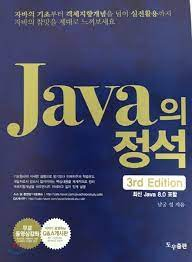

# Java_Study
자바를 공부하면서 실습한 내용을 기록합니다.

## 공부 문서
남궁성의 자바의 정석을 이용하여 공부를 진행 했습니다. 

## 💬사용 기술

## :man_mechanic:구동환경
### OS
 Ventura

## 🖥IDEs/Editors

## Trainning and Summary
- Click the 📰 next to each chapter to see it summarized in a blog.
- Click the chapter title to view the training code folder.
### [Chapter 01 자바를 시작하기 전에](https://github.com/JoonHoSeong/Java_Study/tree/main/Trainning/CH01)<a href=https://slowprogramer.tistory.com/entry/%EC%9E%90%EB%B0%94%EC%9D%98-%EC%A0%95%EC%84%9D-1-%EC%9E%90%EB%B0%94%EB%9E%80> 📰</a>
